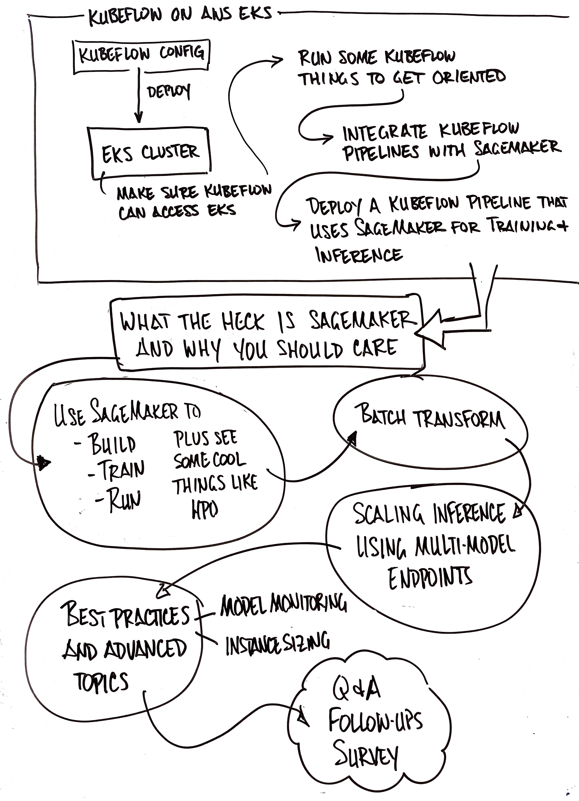

# AWS Machine Learning Workshop

This is a set of instructions and exercises for a Machine Learning Workshop. This Machine Learning oriented content is focused on the use of Kubernetes (i.e. EKS).

## Overview

These instructions assume your Workshop is using Event Engine. You will have the following resources pre-configured in `us-west-2 (Oregon)` region:

- EKS Cluster named **kf-sm-workshop**
- Sagemaker Notebook with `AWS CLI`, `eksctl`, `kubectl`, `aws-iam-authentictor`, `git`, and `kfctl`.

Note: if you are running this workshop on your own, please see the [Self Paced Instructions](README-SELFPACED.md) (_Note: as of April 30, these instructions are still in construction and may not work properly_).

## Things to Know

These are some things to be aware of before starting this workshop.

- [Juypter Notebooks](https://www.dataquest.io/blog/jupyter-notebook-tutorial/) - This will be used in the KubeFlow labs and is an optional interface.
- [JuypterLab](https://codingclubuc3m.rbind.io/post/2019-05-08/) - This is the recommended way to run the SageMaker labs. The multi-window capability makes the labs easier to run.
- [Kubeflow Overview](https://www.kubeflow.org/docs/started/kubeflow-overview/) - Part of these instructions are to install and use Kubeflow on AWS EKS. [Kubeflow on AWS EKS](https://aws.amazon.com/blogs/opensource/kubeflow-amazon-eks/)
- [AWS EKS Architecture](https://aws.amazon.com/quickstart/architecture/amazon-eks/) - The Managed Kubernetes Service from AWS.

## What You Will Learn

- How to deploy Kubeflow on AWS EKS
- How to leverage the AWS Machine Learning Managed Service, Amazon SageMaker, from Kubeflow Pipelines.
- How to Build, Train, and Deploy Machine Learning Models using Amazon SageMaker.
- Batch Transform using Amazon SageMaker.
- Scaling Machine Learning Inference using SageMaker Multi-Model Endpoints.
- Best Practices for sizing Machine Learning instances.
  - Machine Learning Model Monitoring (drift, re-training).
  - Instance sizing

## Visual Roadmap



## What You Will Need

- A modern browser with an internet connection
- (recommended) 2 monitors or high enough resolution to run side-by-side windows
- (If running as part of an AWS Workshop) [Amazon Chime App](https://aws.amazon.com/chime/)

## First Steps (AWS Workshop)

1. Login to your AWS Account using the supplied method.
2. Navigate to [SageMaker Service](https://us-west-2.console.aws.amazon.com/sagemaker/)
3. Verify / Change to the Oregon (us-west-2) region
4. Launch **Juypter** (or **Juypter Hub**) on the **BasicNotebookInstance**
5. Open a terminal and switch to 'bash' by typing `bash` at the terminal prompt
6. Run the command: `eksctl get clusters` - you should see the following:
   ```
   NAME            REGION
   kf-sm-workshop  us-west-2
   ```
7. Run the command: `aws eks update-kubeconfig --name kf-sm-workshop`
8. Confirm connectivity to EKS by running `kubectl get nodes -A` - you should see a list of six nodes.

# What's Next

If you want to follow along in a different browser, navigate to **[The Source Github project](https://github.com/jwnichols3/aws-immersion-ml-public)**.

There are several labs included with this Workshop, including:

- [Kubeflow on EKS](labs/kubeflow/README.md)
- [Kubeflow Pipelines with SageMaker](labs/sagemaker-kubeflow-pipeline/README.md)
- [SageMaker Operators for Kubernetes](labs/sagemaker-operators-for-k8s/README.md)
- [SageMaker Build Train Deploy](labs/sagemaker/build-train-deploy/)
- [SageMaker Hyper-Parameter Optimization](labs/sagemaker/README.md)
- [SageMaker Batch Transform](labs/sagemaker/README.md)
- [SageMaker Multi-Model Endpoints (MME)](labs/sagemaker/README.md)
