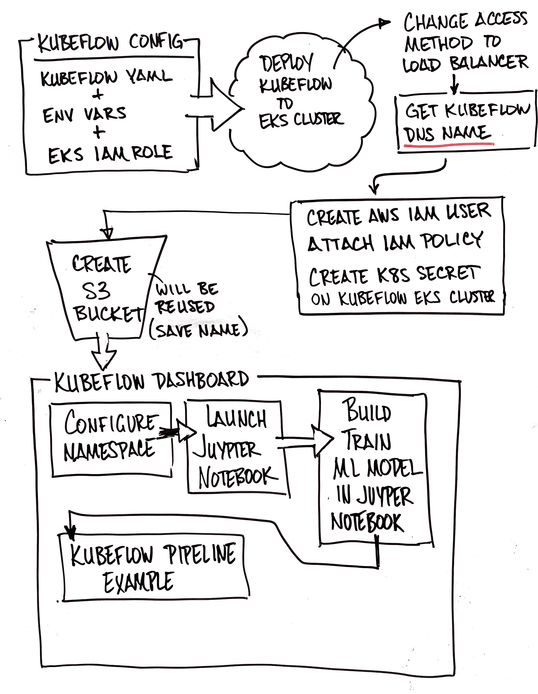

# Install Kubeflow on Amazon EKS

Note: these instructions are in the context of an Event Engine-based workshop. If you're in a workshop led by AWS, it is likely you're using Event Engine. If you're running this on your own, see the [Self Paced Instructions](README-SELFPACED.md).

## Visual Roadmap



## Setup Kubeflow Configuration

Use the following kfctl configuration file for the standard AWS setup:

```shell
export CONFIG_URI="https://raw.githubusercontent.com/kubeflow/manifests/master/kfdef/kfctl_aws.v1.0.2.yaml"
```

Set an environment variable for your AWS cluster name, and set the name of the Kubeflow deployment to the same as the cluster name

```shell
export AWS_CLUSTER_NAME=kf-sm-workshop
export KF_NAME=${AWS_CLUSTER_NAME}
```

Set the path to the base directory where you want to store one or more Kubeflow deployments
Then set the Kubeflow application directory for this deployment:

```shell
mkdir /home/ec2-user/SageMaker/kubeflow
export BASE_DIR=/home/ec2-user/SageMaker/kubeflow
export KF_DIR=${BASE_DIR}/${KF_NAME}
echo -e "\nConfirmation of KF_DIR... This should include the EKS Cluster Name at the end.\n"
echo ${KF_DIR}
```

### Setup Kubeflow configuration file

Download your configuration files, so that you can customize the configuration before deploying Kubeflow:

```shell
mkdir -p ${KF_DIR}
cd ${KF_DIR}
wget -O kfctl_aws.yaml $CONFIG_URI
export CONFIG_FILE=${KF_DIR}/kfctl_aws.yaml
```

#### kfctl config file update with EKS Cluster Name

Replace the AWS cluster name in your `${CONFIG_FILE}` file, by changing the value kubeflow-aws to `${AWS_CLUSTER_NAME}` in multiple locations in the file. For example, use this sed command:

```shell
sed -i'.bak' -e 's/kubeflow-aws/'"$AWS_CLUSTER_NAME"'/' ${CONFIG_FILE}
```

#### Update IAM Role in the kfctl config file

Get and IAM role name for your worker nodes. To get the IAM role name for your Amazon EKS worker node, run the following command:

```shell
export ROLE_NAME=`aws iam list-roles | jq -r ".Roles[] | select(.RoleName | startswith(\"eksctl-$AWS_CLUSTER_NAME\") and contains(\"NodeInstanceRole\")) .RoleName"`
```

Update the `roles:` value in your `${CONFIG_FILE}` file (`/home/ec2-user/SageMaker/kubeflow/kf-sm-workshop/kfctl_aws.yaml`), replacing the value with the ROLE_NAME. (example output: `eksctl-kf-sm-workshop-nodegroup-ng-a2-NodeInstanceRole-xxxxxxx`), We will use the sed comamnd to do this:

```shell
sed -i'.bak2' -e 's/eksctl-kf-sm-workshop-nodegroup-ng-a2-NodeInstanceRole-xxxxxxx/'"$ROLE_NAME"'/' ${CONFIG_FILE}
```

### Deploy Kubeflow

Run the following commands to initialize the Kubeflow cluster:

```shell
kfctl apply -V -f ${CONFIG_FILE}
```

**_Important!!!_** By default, these scripts create an AWS Application Load Balancer for Kubeflow that is open to public. This is good for development testing and for short term use, but we do not recommend that you use this configuration for production workloads. To secure your installation, Follow the instructions to add authentication and authorization.

Wait for all the resources to become ready in the kubeflow namespace. Run the command below to check the status

```shell
kubectl get pods -n kubeflow
```

It may take 3-5 minutes for all containers to show as either `Running` or `Completed`. Once that happens, run the following command to switch to a Load Balancer configuration.

```shell
kubectl patch service -n istio-system istio-ingressgateway -p '{"spec": {"type": "LoadBalancer"}}'
```

Run this command and look for a value in the EXTERNAL-IP column. It should look like `longlonglong-name.us-west-2.elb.amazonaws.com`. If a value is not there, re-run the command until a value appears.

```shell
kubectl get -n istio-system svc/istio-ingressgateway
```

Here is an example output:

```shell
NAME                   TYPE           CLUSTER-IP       EXTERNAL-IP                                                              PORT(S)                                                                                                                                      AGE
istio-ingressgateway   LoadBalancer   10.100.115.169   a52e60736312d44dd9ad61a3d5101b0a-585255769.us-west-2.elb.amazonaws.com   15020:30447/TCP,80:31380/TCP,443:31390/TCP,31400:31400/TCP,15029:31657/TCP,15030:32404/TCP,15031:32186/TCP,15032:31717/TCP,15443:30449/TCP   27h
```

You will need the DNS name later to access the kubeflow dashboard.

## Kubeflow Dashboard

Open a new browser tab/window.

Use the `istio-ingressgateway` load balancer URL above to access to kubeflow dashboard (if needed, re-run the command `kubectl get -n istio-system svc/istio-ingressgateway` to get the DNS name)

First time when you login, Click on `Start Setup` and then specify a namespace (eg. `kf-sm-workshop` or the default `anonymous`)

Click **finish** to view the dashboard.

On the top-left, click `Select namespace` and change to the namespace you created.

### Jupyter Notebook on Kubeflow

In the quick shortcuts, click on the **Create a Notebook server** link:

- On the top-left, select the namespace created above)
- Give the notebook server a name
- On the Image, choose one that has CPU (e.g. `gcr.io/kubeflow-images-public/tensorflow-1.15.2-notebook-cpu:1.0.0`)
- Leave the remaining options as default.
- Click Launch.

Once the notebook server is created, Click on `CONNECT`. This opens the Jupyter notebook interface in a new browser tab.

Open the terminal using `New`/ `Terminal` dropdown in the notebook interface.

Clone the github repository:

```shell
git clone https://github.com/jwnichols3/aws-immersion-ml-public.git aws-ml-workshop
```

### Run the Training

In the **Jupyter notebook interface**, open the `training.ipynb` file under the `aws-ml-workshop/labs/kubeflow` folder. Run the notebook cells to build a model for **Fashion-MNIST** dataset using **Tensorflow** and **Keras** on the local notebook instance.

## Kubeflow Pipelines

Kubeflow pipelines are reusable end-to-end ML workflows built using the Kubeflow Pipelines SDK.

The Kubeflow pipelines service has the following goals:

- **End to end orchestration**: enabling and simplifying the orchestration of end to end machine learning pipelines
- **Easy experimentation**: making it easy for you to try numerous ideas and techniques, and manage your various trials/experiments
- **Easy re-use**: enabling you to re-use components and pipelines to quickly cobble together end to end solutions, without having to re-build each time

In the Jupyer notebook interface, open the `01_Kubeflow_Pipeline_SDK.ipynb` file under the `aws-ml-workshop/labs/kubeflow` folder. This notebook walks you through an example for building a kubeflow pipeline. Step through the notebook cells to see kubeflow pipeline in action.

### SageMaker Kubeflow Pipeline

In the next lab, we will use the kubeflow pipeline components for Amazon SageMaker and train a classification model using Kmeans with MNIST dataset on SageMaker

See the [README](../sagemaker-kubeflow-pipeline/README.md) for step by step instructions
