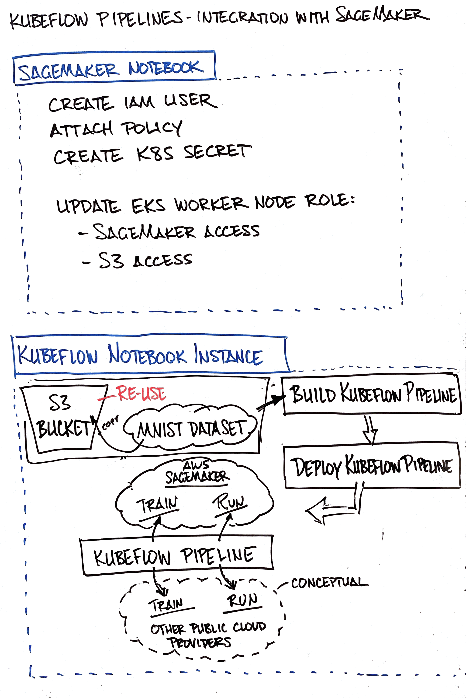

## Visual Roadmap



### Setup AWS credentials in Kubeflow Namespace

**In the SageMaker Notebook Instance**, open the terminal using "New"/"Terminal" dropdown. (File-New-Terminal if Jupyter Lab)

switch to bash

```shell
bash
```

Create an IAM user `kf-smuser`, attach S3 access policy and retrieve temporary credentials

```shell
aws iam create-user --user-name kf-smuser
aws iam attach-user-policy --user-name kf-smuser --policy-arn arn:aws:iam::aws:policy/AmazonSageMakerFullAccess
aws iam create-access-key --user-name kf-smuser > /tmp/create_output.json
```

Next, save the new user’s credentials into environment variables:

```shell
export AWS_ACCESS_KEY_ID_VALUE=$(jq -j .AccessKey.AccessKeyId /tmp/create_output.json | base64)

export AWS_SECRET_ACCESS_KEY_VALUE=$(jq -j .AccessKey.SecretAccessKey /tmp/create_output.json | base64)
```

Create the kubernetes secret in the kubeflow namespace:

```shell
cat <<EOF | kubectl apply -f -
apiVersion: v1
kind: Secret
metadata:
  name: aws-secret
  namespace: kubeflow
type: Opaque
data:
  AWS_ACCESS_KEY_ID: $AWS_ACCESS_KEY_ID_VALUE
  AWS_SECRET_ACCESS_KEY: $AWS_SECRET_ACCESS_KEY_VALUE
EOF

```

### Update the EKS Worker Role with S3 and SageMaker Access

To attach the S3 and SageMaker access policy to the role, follow these steps:

```shell
export ROLE_NAME=`aws iam list-roles | jq -r ".Roles[] | select(.RoleName | startswith(\"eksctl-$AWS_CLUSTER_NAME\") and contains(\"NodeInstanceRole\")) .RoleName"`
```

Add the S3 and SageMaker policy to the role

```shell
TRUST="{ \"Version\": \"2012-10-17\", \"Statement\": [ { \"Effect\": \"Allow\", \"Principal\": { \"Service\": [ \"sagemaker.amazonaws.com\",  \"ec2.amazonaws.com\"]}, \"Action\": \"sts:AssumeRole\" } ] }"

aws iam update-assume-role-policy --role-name $ROLE_NAME  --policy-document file://<(echo "$TRUST")

aws iam attach-role-policy --role-name $ROLE_NAME --policy-arn arn:aws:iam::aws:policy/AmazonSageMakerFullAccess

aws iam attach-role-policy --role-name $ROLE_NAME --policy-arn arn:aws:iam::aws:policy/AmazonS3FullAccess
```

### Assign sagemaker:InvokeEndpoint Permission to the Worker node IAM role

#### Create the Policy Document

```shell
cat <<EoF > sagemaker-invoke.json
{
    "Version": "2012-10-17",
    "Statement": [
        {
            "Effect": "Allow",
            "Action": [
                "sagemaker:InvokeEndpoint"
            ],
            "Resource": "*"
        }
    ]
}
EoF
```

#### Apply the Policy

```shell
aws iam put-role-policy --role-name $ROLE_NAME --policy-name sagemaker-invoke-for-worker --policy-document file://sagemaker-invoke.json
```

## Switch to KubeFlow Notebook and Run the SageMaker Pipeline Workbook

In the **Jupyter notebook interface of the Kubeflow notebook server** instance, open the `sagemaker-kubeflow-pipeline.ipynb` file under the `aws-ml-workshop/labs/sagemaker-kubeflow-pipeline` folder.

This notebook walks you through an example for building a kubeflow pipeline and build and deploy an **MNIST** classification model using Amazon SageMaker. Step through the notebook cells to see SageMaker kubeflow pipeline components in action. **Remeber to pass in the SageMaker execution Role ARN to successfully run the job**.
